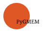

.. -*- mode: rst -*-

|PythonVersion|_

.. |PythonVersion| image:: https://img.shields.io/badge/python-3.7%20%7C%203.8%20%7C%203.9-blue
.. _PythonVersion: https://img.shields.io/badge/python-3.7%20%7C%203.8%20%7C%203.9-blue

.. |PythonMinVersion| replace:: 3.7

**pygmem** is a Python module for generalized (non linear) mixed effect models for statistical learning tasks built on top of pytorch. There are no inference of the variance like in more statistically oriented libraries. 

The library is written with pytorch, and is only working with only one type of group (individualized prediction regarding one type of group). 

It's designed for a usecase with large dataset (Netflix, LinkedIn), compared to a more statistical regression approach.

There is an option for non-linear cases, with a possible input-encoder (for images), and also a decoder, and the mixed-effect model would be done on linearized intermediary space

You also choose the type of regression you choose to do (Gaussian, Poisson, Binary prediction) by choosing an ouput function theta.

It is currently maintained by mcordier.

Website: To Come

Installation
------------

Dependencies
~~~~~~~~~~~~

scikit-learn requires:

- Python (>= |PythonMinVersion|)
- NumPy
- SciPy
- PyTorch
- Pandas
- Matplotlib
- Tqdm

=======

**PyGmem is requiring Python |PythonMinVersion| at minimum**

User installation
~~~~~~~~~~~~~~~~~

The easiest way to install PyGmem is using ``pip``. Go to the pygmem directory and run   ::

    pip install .

For developpers, you can run ::

	pip install -e .

Important links
~~~~~~~~~~~~~~~

- Official source code repo: https://github.com/mcordier/pygmem
- Introduction to Linear Mixed Effect Models: https://en.wikipedia.org/wiki/Generalized_linear_mixed_model

Project History
---------------

The project was started in 2020. At the moment, only a single group of random effects
is supported

Help and Support
----------------

Documentation
~~~~~~~~~~~~~

To get introduced to this library, I recommend to first look at the script examples
in the examples folder. The way you fit a GMEM model is similar to other machine learning
libraries. There are three main type of classes in this library. First, the GMEM model itself,
available at the higher level. Then, there are the network classes, which are neural networks set
up with pytorch, used by the GMEM model. Then the datasets models is used for the data ingestion in 
pytorch.

Communication
~~~~~~~~~~~~~
If you have any interest, questions or request concerning this python library,
you can contact me at matt.cordier.95@gmail.com.

Citation
~~~~~~~~

If you use PyGmem in a scientific publication, we would appreciate citations.